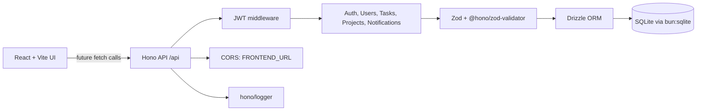

# TaskFlow


TaskFlow is a Vite React task dashboard with a Bun-native Hono API backend.
The backend uses Drizzle ORM with SQLite, Zod request validation, JWT auth,
and `Bun.password` for password hashing.

## Contents

- [Architecture](#architecture)
- [Frontend Audit](#frontend-audit)
- [Technical Decisions](#technical-decisions)
- [Assumptions](#assumptions)
- [Tradeoffs](#tradeoffs)
- [Setup](#setup)
- [Environment Variables](#environment-variables)
- [API Endpoints](#api-endpoints)
- [Verification](#verification)
- [Deployment Notes](#deployment-notes)

## Architecture



Backend source layout:

```text
backend/src/
  index.ts
  app.ts
  db/
    index.ts
    migrate.ts
    schema.ts
  middleware/
    auth.ts
    error.ts
  routes/
    auth.ts
    index.ts
    notifications.ts
    projects.ts
    tasks.ts
    users.ts
  validators/
    auth.ts
    notifications.ts
    projects.ts
    tasks.ts
    users.ts
```

## Frontend Audit

The current `frontend/src/` code has no network API calls. It uses local
component state, `MOCK_USERS`, `MOCK_PROJECTS`, `MOCK_NOTIFICATIONS`, and
`INITIAL_TASKS` from `frontend/src/data.ts`, with task persistence stored in
`localStorage` under `taskflow_tasks_list`.

There is no frontend auth token flow yet: no token is stored, and no
`Authorization` header is sent. `frontend/.env.example` currently defines
Gemini/App URL variables and no backend URL variable.

UI-rendered models:

| Model | Fields |
| --- | --- |
| User | `id`, `name`, `email`, `avatar`, `bio`, `role`, `status` |
| Task | `id`, `title`, `description`, `status`, `category`, `priority`, `dueDate`, `dateLabel`, `assigneeId`, `starred` |
| Notification | `id`, `title`, `content`, `time`, `read` |
| Project | `id`, `name`, `progress`, `color`, `tasksCount` |

## Technical Decisions

| Area | Decision | Reason |
| --- | --- | --- |
| Runtime | Bun | Matches the requested stack and gives native `bun:sqlite` plus `Bun.password`. |
| HTTP framework | Hono | Small Bun-friendly API surface with built-in middleware support. |
| Authentication | JWT signed with `JWT_SECRET`, 7-day expiry | Stateless auth, easy to consume from a future SPA integration. |
| Password storage | `Bun.password.hash` / `Bun.password.verify` | Uses Bun's built-in bcrypt support without extra dependencies. |
| Database | SQLite via `bun:sqlite` | Lightweight local persistence with explicit migrations. |
| ORM | Drizzle | Type-safe schema and SQL access without hiding relational details. |
| Validation | Zod schemas per resource | Every `POST` and `PATCH` body is validated before route logic runs. |
| Response shape | `{ data }` and `{ error }` | Simple contract aligned with the original backend requirements. |

## Assumptions

- The frontend is not integrated with the backend yet, so the API mirrors the
  UI models that the current React screens render.
- `dateLabel` is persisted on tasks because the UI expects it as a rendered
  field, even though it can be derived from `status` and `dueDate`.
- `GET /api/users` is scoped to the signed-in user to satisfy the backend rule
  that all authenticated queries are filtered by `userId`.
- The current project keeps SQLite as the production database target because
  the requested stack explicitly specified Drizzle with `bun:sqlite`.
- Frontend quick-login/social buttons remain UI-only until the React app is
  wired to `/api/auth/register` and `/api/auth/login`.

## Tradeoffs

| Tradeoff | Benefit | Cost |
| --- | --- | --- |
| SQLite instead of Postgres | Minimal setup and simple local/Railway deployment with a persisted file. | Horizontal scaling and managed backups require more care. |
| JWT stateless sessions | No session table or cache required. | Token revocation needs an additional denylist/session model later. |
| Persisted `dateLabel` | Frontend can render directly with no extra mapping layer. | Backend must keep label logic consistent during task updates. |
| Narrow user listing | Stronger tenant isolation by default. | A future team directory may need a separate membership-aware endpoint. |
| Backend built before frontend integration | API contract is ready and tested. | React still uses local state until a client data layer is added. |

## Setup

### Frontend

```bash
cd frontend
bun install
bun run dev
```

### Backend

```bash
cd backend
bun install
cp .env.example .env
bun run db:generate
bun run db:migrate
bun run dev
```

## Environment Variables

Backend (`backend/.env.example`):

| Variable | Required | Description |
| --- | --- | --- |
| `PORT` | No | Backend HTTP port. Defaults to `3000`. |
| `JWT_SECRET` | Yes | Secret used to sign and verify 7-day JWTs. Startup fails when missing. |
| `DATABASE_URL` | No | SQLite database path. Defaults to `./dev.db`. |
| `FRONTEND_URL` | No | Allowed CORS origin. Defaults to `http://localhost:5173`. |

Frontend (`frontend/.env.example`):

| Variable | Required | Description |
| --- | --- | --- |
| `GEMINI_API_KEY` | Existing template | Gemini key from the original frontend template. Not used by the backend. |
| `APP_URL` | Existing template | App hosting URL from the original frontend template. |

## API Endpoints

All routes are mounted under `/api`. Protected routes require
`Authorization: Bearer <token>`.

| Method | Path | Auth | Body | Success |
| --- | --- | --- | --- | --- |
| `POST` | `/api/auth/register` | No | `{ name, email, password }` | `201 { token, user }` |
| `POST` | `/api/auth/login` | No | `{ email, password }` | `200 { token, user }` |
| `GET` | `/api/users/me` | Yes | None | `200 { data: user }` |
| `PATCH` | `/api/users/me` | Yes | partial `{ name, avatar, bio, role, status }` | `200 { data: user }` |
| `GET` | `/api/users` | Yes | None | `200 { data: user[] }` |
| `GET` | `/api/users/:id` | Yes | None | `200 { data: user }` |
| `GET` | `/api/tasks` | Yes | None | `200 { data: task[] }` |
| `GET` | `/api/tasks/:id` | Yes | None | `200 { data: task }` |
| `POST` | `/api/tasks` | Yes | `{ title, description, status, category, priority, dueDate, assigneeId, starred }` | `201 { data: task }` |
| `PATCH` | `/api/tasks/:id` | Yes | partial task body | `200 { data: task }` |
| `DELETE` | `/api/tasks/:id` | Yes | None | `200 { data: task }` |
| `GET` | `/api/projects` | Yes | None | `200 { data: project[] }` |
| `GET` | `/api/projects/:id` | Yes | None | `200 { data: project }` |
| `POST` | `/api/projects` | Yes | `{ name, progress, color, tasksCount }` | `201 { data: project }` |
| `PATCH` | `/api/projects/:id` | Yes | partial project body | `200 { data: project }` |
| `DELETE` | `/api/projects/:id` | Yes | None | `200 { data: project }` |
| `GET` | `/api/notifications` | Yes | None | `200 { data: notification[] }` |
| `POST` | `/api/notifications` | Yes | `{ title, content, time, read }` | `201 { data: notification }` |
| `PATCH` | `/api/notifications/:id` | Yes | partial notification body | `200 { data: notification }` |
| `DELETE` | `/api/notifications/:id` | Yes | None | `200 { data: notification }` |
| `GET` | `/health` | No | None | `200 { data: { status: "ok" } }` |

Common errors return `{ error }` with appropriate status codes: `400` for
validation, `401` for missing/invalid auth, `404` for missing records, and
`409` for duplicate registration.

## Verification

```bash
cd backend
bun test
bun run typecheck
bun run db:generate
bun run db:migrate

cd ../frontend
bun run lint
bun run build
```

## Deployment Notes

Deploy the frontend to Vercel as a static Vite app. Set any frontend
environment variables in Vercel project settings.

Deploy the backend to Railway with Bun. Set `JWT_SECRET`, `DATABASE_URL`,
`FRONTEND_URL`, and optional `PORT` in Railway variables. Use
`bun run db:migrate` during release/startup before `bun run start`, and persist
the SQLite database path with Railway storage if using SQLite in production.
